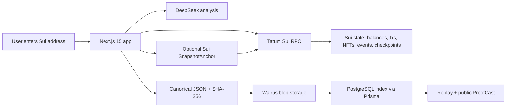

# ProofCast

AI-powered verifiable onchain memory for the Sui ecosystem.

ProofCast turns any Sui wallet, DAO treasury, NFT collector, or smart contract address into a permanent historical timeline. It reads live Sui state through Tatum, stores canonical snapshots on Walrus, generates DeepSeek AI reports, and optionally anchors snapshot hashes on Sui.

## Architecture



## Walrus Integration

Walrus is the memory layer. ProofCast stores complete canonical JSON blobs for:

- wallet snapshots
- AI reports
- replay state
- DAO treasury reports
- audit artifacts
- Chain Memories narratives

Each snapshot includes transactions, balances, NFTs, contract events, AI summary, risk analysis, previous hash, and current hash. The database only indexes blob IDs, hashes, proof URLs, and operational metadata.

## Tatum Integration

All Sui reads and transaction submissions route through Tatum Sui RPC with server-side `x-api-key` authentication.

`TatumService` implements:

- `getWalletBalance`
- `getTransactions`
- `getOwnedNFTs`
- `getObjectData`
- `getContractEvents`
- `getLatestCheckpoint`
- `getTreasuryActivity`

## Setup

```bash
corepack pnpm install
corepack pnpm env:bootstrap
docker compose up -d postgres redis
corepack pnpm prisma:generate
cd apps/web && corepack pnpm prisma:migrate
corepack pnpm dev
```

Required environment variables:

```bash
DATABASE_URL=
DIRECT_URL=
REDIS_URL=
TATUM_API_KEY=
TATUM_SUI_NETWORK=testnet
TATUM_SUI_RPC_URL=https://sui-testnet.gateway.tatum.io
WALRUS_NETWORK=testnet
WALRUS_PUBLISHER_URL=https://publisher.walrus-testnet.walrus.space
WALRUS_AGGREGATOR_URL=https://aggregator.walrus-testnet.walrus.space
DEEPSEEK_API_KEY=
DEEPSEEK_MODEL=deepseek-v4-flash
NEXT_PUBLIC_APP_URL=http://localhost:3000
SUI_PROOFCAST_PACKAGE_ID=
```

## Deployment

- Vercel hosts `apps/web`.
- Railway hosts PostgreSQL and Redis.
- Sui package is published from `contracts/sui/proofcast_registry`.
- Set `SUI_PROOFCAST_PACKAGE_ID` after publishing to enable wallet-signed anchors.
- Full deployment instructions live in [`docs/deployment.md`](docs/deployment.md).

Preflight command:

```bash
corepack pnpm deploy:check
```

Production migration command:

```bash
corepack pnpm prisma:deploy
```

## Demo Flow

1. Open dashboard.
2. Load a seeded Sui demo wallet.
3. Capture live state via Tatum.
4. Store canonical snapshot and AI report on Walrus.
5. Open snapshot detail and public ProofCast.
6. Verify Walrus hash and Tatum checkpoint.
7. Replay historical frames.
8. Generate a Chain Memory and store it on Walrus.

## Live-only Policy

ProofCast does not fake blockchain, Walrus, or AI success. If Tatum, Walrus, DeepSeek, PostgreSQL, or Redis are missing, the UI shows explicit blockers.

## Auth

ProofCast uses Sui wallet connect through Mysten dapp-kit. Server-side auth endpoints issue a Redis-backed nonce and verify wallet signatures with `verifyPersonalMessageSignature`.
