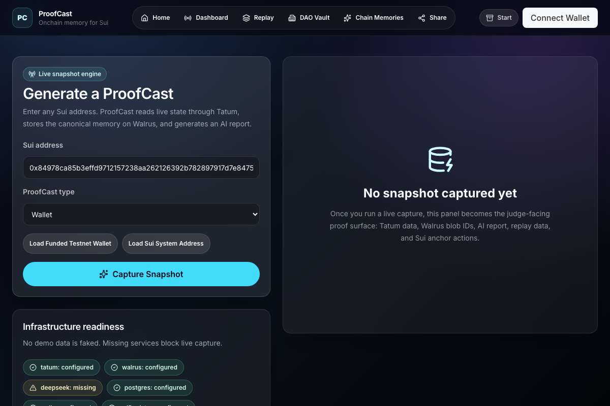
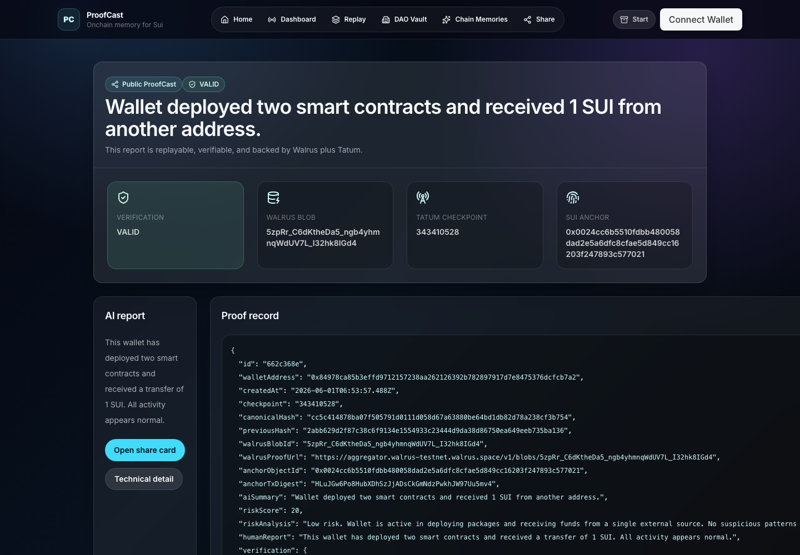
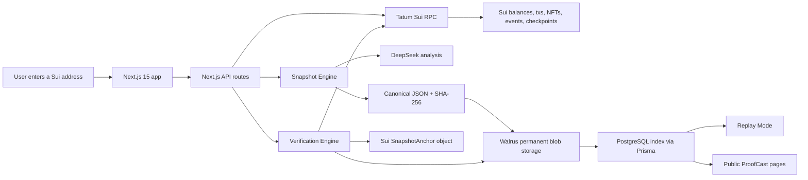

# ProofCast

AI-powered verifiable onchain memory for the Sui ecosystem.

[Live App](https://proofcast.vercel.app) |
[Project Explainer](https://proofcast.vercel.app/project) |
[Tatum MCP Guide](https://proofcast.vercel.app/mcp) |
[Verified ProofCast](https://proofcast.vercel.app/proofcast/ad8568e9) |
[DAO Treasury Proof](https://proofcast.vercel.app/proofcast/005fd329)

ProofCast turns any Sui wallet, DAO treasury, NFT collector, or smart contract address into a permanent, replayable historical timeline.

It reads live Sui activity through Tatum, stores complete canonical snapshots on Walrus, generates AI explanations, and lets anyone verify that the stored memory still matches blockchain reality.

> Think GitHub commits for blockchain activity: every important wallet moment becomes understandable, permanent, and independently checkable.



## Why This Exists

Blockchains are permanent, but their history is hard to understand.

A DAO treasury can move funds, a wallet can deploy contracts, an NFT collector can change strategy, and months later the raw chain data is still there, but the story is buried in transaction hashes, object IDs, checkpoints, and event payloads.

ProofCast makes that history usable:

- Tatum is the real-time Sui intelligence layer.
- Walrus is the permanent memory layer.
- DeepSeek turns raw activity into human-readable reports.
- Sui anchors can connect Walrus memory back to an onchain proof object.

## Live Production Demo

The app is deployed and seeded with real production artifacts.

| Surface | Link |
| --- | --- |
| Live app | <https://proofcast.vercel.app> |
| Beginner-friendly explainer | <https://proofcast.vercel.app/project> |
| Tatum MCP-only guide | <https://proofcast.vercel.app/mcp> |
| Verified wallet ProofCast | <https://proofcast.vercel.app/proofcast/ad8568e9> |
| DAO Treasury ProofCast | <https://proofcast.vercel.app/proofcast/005fd329> |
| Public share card | <https://proofcast.vercel.app/share/ad8568e9> |

Production health endpoint:

```text
https://proofcast.vercel.app/api/health
```

Expected state:

```json
{
  "ok": true,
  "integrations": {
    "tatum": "configured",
    "walrus": "configured",
    "deepseek": "configured",
    "postgres": "configured",
    "redis": "configured",
    "suiRegistry": "configured"
  }
}
```

## Verified Production Artifacts

These are live testnet artifacts created by the deployed app, not local-only examples.

| Artifact | Value |
| --- | --- |
| Wallet ProofCast slug | `ad8568e9` |
| Wallet snapshot Walrus blob | `Q9JTJ2n34bglur7WGtUSaOEN2REc14rzASc1Wg-rUn4` |
| Wallet snapshot canonical hash | `c32a47fd210500bf1b1d3470344dfc09d4800d6797a5f140f2ff1a1039776a29` |
| Chain Memory Walrus blob | `SMnGD_Ow1TkQonCbivwGYb-2yTNReXFfgf1eMfAPiXQ` |
| DAO Treasury ProofCast slug | `005fd329` |
| DAO snapshot Walrus blob | `4ib8OEmVKayTOCknOl_uCmJUwCw9u6tR-km5og79jIA` |
| DAO treasury report Walrus blob | `3ROnFeK8GszFsbX61ZZvJVbDzClinQm5QpPsdZ9zIPs` |
| Sui registry package | `0x5b1e806f83c0aa9fd787cf651b6277a45cc562669e6806010ff5cefa156dc9f0` |

## What Judges Should Notice

ProofCast is not a static demo and does not fake integration success.

- Captures live balances, transactions, NFTs, events, and checkpoints through Tatum Sui RPC.
- Stores full canonical snapshot JSON on Walrus.
- Stores AI reports, DAO treasury reports, replay states, audit artifacts, and Chain Memories on Walrus.
- Reconstructs Replay Mode from Walrus payloads, not from fake UI state.
- Verifies Walrus retrieval, canonical hash equality, Tatum checkpoint/transaction inclusion, and optional Sui anchor fields.
- Shows setup blockers when any required service is missing.
- Uses official Tatum MCP as the only MCP path for agent-facing blockchain intelligence.

## Product Walkthrough

1. Enter a Sui address on the dashboard.
2. ProofCast reads live blockchain state through Tatum.
3. The Snapshot Engine builds canonical JSON.
4. DeepSeek generates an activity summary, risk score, and human report.
5. The full snapshot is uploaded to Walrus.
6. PostgreSQL stores only indexes, hashes, proof URLs, and operational metadata.
7. The Verification Engine re-fetches Walrus and Tatum data to prove the memory is real.
8. Public ProofCast and Replay Mode make the history understandable to non-technical viewers.



## Walrus Integration

Walrus is the core product layer, not a file dump.

Every meaningful memory artifact is stored as a Walrus blob:

- canonical wallet snapshots
- AI activity reports
- DAO treasury reports
- Chain Memories narratives
- replay source states
- audit records

Snapshot shape:

```json
{
  "snapshotId": "ad8568e9-c2dd-46b8-b82c-6e653df893f4",
  "walletAddress": "0x8497...",
  "timestamp": "2026-06-02T08:11:50.562Z",
  "transactions": [],
  "balances": [],
  "nfts": [],
  "contractEvents": [],
  "aiSummary": "Wallet deployed two smart contracts...",
  "riskAnalysis": "Low risk...",
  "previousHash": null,
  "currentHash": "c32a47fd210500bf1b1d3470344dfc09d4800d6797a5f140f2ff1a1039776a29",
  "source": {
    "chain": "sui",
    "network": "testnet",
    "provider": "tatum",
    "storage": "walrus"
  }
}
```

The database never stores decrypted private content or pretends to be the source of truth. It is an index over Walrus and Sui evidence.

## Tatum Integration

All blockchain reads and transaction execution paths route through Tatum.

`TatumService` implements:

- `getWalletBalance()`
- `getTransactions()`
- `getOwnedNFTs()`
- `getObjectData()`
- `getContractEvents()`
- `getLatestCheckpoint()`
- `getTreasuryActivity()`
- `getTransactionBlock()`

Security guard:

- `/api/tatum/rpc` is rate-limited.
- Only approved Sui RPC methods are allowed.
- Unsafe methods such as `unsafe_paySui` return `403`.
- Tatum API keys stay server-side.

## Tatum MCP Only

ProofCast does not run a custom MCP server.

For MCP, the project intentionally uses official Tatum MCP only:

```json
{
  "mcpServers": {
    "tatumio": {
      "command": "npx",
      "args": ["@tatumio/blockchain-mcp"],
      "env": {
        "TATUM_API_KEY": "YOUR_TATUM_API_KEY"
      }
    }
  }
}
```

Judges can view the live MCP explanation at:

```text
https://proofcast.vercel.app/mcp
```

## Verification Engine

ProofCast verification checks four independent layers:

| Layer | What is checked |
| --- | --- |
| Walrus | Blob exists, payload is retrievable, byte hash is valid |
| Hashing | Canonical JSON recomputes to the stored snapshot hash |
| Tatum | Latest checkpoint and sampled transactions/events are re-fetched |
| Sui anchor | Optional `SnapshotAnchor` object fields match the Walrus blob, hash, checkpoint, and wallet |

Verification output includes:

- `walrusOk`
- `hashOk`
- `tatumOk`
- `anchorOk`
- sampled transaction inclusion
- sampled event inclusion
- missing transaction/event lists

## Replay Mode

Replay Mode reconstructs historical wallet frames from Walrus-backed snapshots.

It does not build frames from mock data or cached frontend state. PostgreSQL is used as an index, then each frame retrieves its canonical payload from Walrus and recomputes the hash before rendering.

Each replay frame includes:

- `source: "walrus"`
- `walrusVerified`
- `hashOk`
- `walrusProofUrl`
- balance, transaction, NFT, risk, and checkpoint metrics

## DAO Memory Vault

DAO Memory Vault is the enterprise use case.

It captures treasury addresses and creates:

- live Tatum-powered treasury snapshots
- AI treasury summaries
- inflow/outflow context
- risk flags
- Walrus-stored treasury reports
- public ProofCast links
- replayable treasury history

Production DAO proof:

```text
https://proofcast.vercel.app/proofcast/005fd329
```

## Chain Memories

Chain Memories turns verified snapshots into permanent historical stories.

Example production Chain Memory:

- title: `The Genesis of a Snapshot Keeper`
- Walrus blob: `SMnGD_Ow1TkQonCbivwGYb-2yTNReXFfgf1eMfAPiXQ`
- citations: live Sui transaction digests

The AI story is stored on Walrus as an immutable narrative artifact, so the output is not just text in a UI session.

## Architecture



## Repository Structure

```text
apps/web
  app                 Next.js App Router pages and API routes
  components          shared UI components
  features            dashboard, replay, DAO vault, memories
  server              services, env, db, cache, validation
  prisma              PostgreSQL schema and migrations

contracts/sui
  proofcast_registry  Move package for SnapshotAnchor objects

docs
  architecture.md
  demo-script.md
  deployment.md
  tatum-mcp.md
```

## Tech Stack

| Area | Stack |
| --- | --- |
| Frontend | Next.js 15, React, TypeScript, Tailwind, shadcn-style UI, Framer Motion, Recharts |
| Backend | Next.js API routes, TypeScript, Zod validation |
| Blockchain | Sui, Move, Tatum Sui RPC |
| Storage | Walrus HTTP publisher and aggregator |
| AI | DeepSeek Chat Completions |
| Database | PostgreSQL, Prisma ORM |
| Cache | Redis |
| Deployment | Vercel, Railway |

## Local Setup

```bash
corepack pnpm install
corepack pnpm env:bootstrap
docker compose up -d postgres redis
corepack pnpm prisma:generate
cd apps/web && corepack pnpm prisma:migrate
cd ../..
corepack pnpm dev
```

Required env vars:

```bash
DATABASE_URL=
DIRECT_URL=
REDIS_URL=
TATUM_API_KEY=
TATUM_SUI_NETWORK=testnet
TATUM_SUI_RPC_URL=https://sui-testnet.gateway.tatum.io
WALRUS_NETWORK=testnet
WALRUS_PUBLISHER_URL=https://publisher.walrus-testnet.walrus.space
WALRUS_AGGREGATOR_URL=https://aggregator.walrus-testnet.walrus.space
DEEPSEEK_API_KEY=
DEEPSEEK_MODEL=deepseek-chat
NEXT_PUBLIC_APP_URL=http://localhost:3000
SUI_PROOFCAST_PACKAGE_ID=
```

## Deployment

Production is deployed at:

```text
https://proofcast.vercel.app
```

Deployment targets:

- Vercel hosts `apps/web`.
- Railway hosts PostgreSQL and Redis.
- Sui package is published from `contracts/sui/proofcast_registry`.

Full instructions:

```text
docs/deployment.md
```

Preflight:

```bash
corepack pnpm deploy:check
```

Production migrations:

```bash
corepack pnpm prisma:deploy
```

## Tests And Checks

Current release checks:

- `corepack pnpm env:check`
- `corepack pnpm lint`
- `corepack pnpm typecheck`
- `corepack pnpm test`
- `corepack pnpm prisma:validate`
- `corepack pnpm build`
- `corepack pnpm move:build`

Production smoke checks performed:

- `/api/health` returns `ok: true`
- `/dashboard`, `/project`, `/mcp`, `/dao`, `/memories`, `/replay` return `200`
- public proof pages return `200`
- replay returns Walrus-sourced frames
- Tatum RPC allowlist blocks unsafe calls
- Walrus blob verification passes

## Demo Script

The 3-minute demo script is in:

```text
docs/demo-script.md
```

Suggested live demo order:

1. Open `/project` for the beginner-friendly explanation.
2. Open `/dashboard` and load the funded testnet wallet.
3. Capture a live ProofCast.
4. Show the Walrus blob ID and proof URL.
5. Open `/proofcast/ad8568e9`.
6. Open `/replay` to show Walrus-backed historical reconstruction.
7. Open `/dao` and show the DAO Memory Vault.
8. Open `/mcp` to show official Tatum MCP usage.

## Live-Only Policy

ProofCast fails closed.

If Tatum, Walrus, DeepSeek, PostgreSQL, or Redis are missing, the UI shows explicit setup blockers instead of fake success states.

This is deliberate: the judging story only works if the proof is real.

## Why ProofCast Can Win

ProofCast is built directly around the hackathon prizes:

- Best Walrus Integration: Walrus is the permanent memory layer for snapshots, AI reports, treasury reports, replay frames, audit artifacts, and Chain Memories.
- Best Use of Tatum Tools: Tatum powers all Sui reads, transaction lookups, object fetches, event fetches, checkpoint verification, RPC proxying, and the official MCP story.
- Main Prize: the product is understandable to non-technical judges, visually polished, live-deployed, and built around a real user need: making blockchain history permanent, readable, and verifiable.

## License

Built for the Tatum x Walrus Hackathon.
